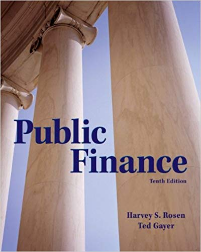

# CSUN Econ 433: Public Economics

# Fall 2023 Syllabus

# Table of Contents

- [Quick Syllabus](#quick-syllabus)
- [Tentative Schedule](#tentative-schedule)
- [Course Description](#course-description)
- [Course Materials](#course-materials)
- [Group Project Details](#group-project-details)
- [Additional Course Policies and Resources](#additional-course-policies)

# Quick Syllabus

### Professor

- Dr. Edward Kung
- edward.kung@csun.edu

### Lectures

- Section 01 Tu 7:00pm - 9:45pm @ Bookstein 2125

### Office Hours

- Tu 5:55pm - 6:55pm @ Bookstein 4252

### Course Organization

This is an in-person class with one 2:45 hour session a week. The first half of each meeting will be a lecture or discussion about the previous week's reading assignment. The second half of each meeting will be an interactive lab session or a group project work meeting.

Attendance is required.

### Weekly Time Expectations

- One 2:45 hour in-person session a week
- 2 to 4 hours of homework and self study per week

### Grading

- **Homework Assignments (25%)**
  - These will usually be reading assignments (textbook chapter or article) and an associated Canvas quiz. These quizzes are due on Mondays, with a penalty for late submissions. You'll usually have three attempts on each quiz.
  
- **Weekly Labs (25%)**
  - In-class lab sessions where you get hands-on experience working with data analysis relevant to policy. Lab assignments will be introduced, completed, and graded *in-class*. If you can't finish in class, you have the opportunity to submit your code by the following Monday, with a late penalty. There may also be in-class quizzes associated with the labs.
  
- **In-Class Quizzes (10%)**
  - Occassionally, I will give a short quiz in-class related to that week's lecture or discussion. 
  
- **Programming Exams (15%)**
  - There will be two programming exams. These will be administered and completed in-class.

- **Group Project (25%)**
  - There will be a group project with three deliverables: 1) a review article for a research paper; 2) a research proposal; and 3) a presentation to the class. More information below.
  
|  A     |  A-   |  B+   |  B    |  B-   |  C+   |  C    |  C-   |  D    |  F   |
| ------ | ----- | ----- | ----- | ----- | ----- | ----- | ----- | ----- | ---- |
| 100-93 | 92-90 | 89-87 | 86-83 | 82-80 | 79-77 | 76-73 | 72-70 | 69-60 | 59-0 |

# Tentative Schedule

| Week  | Date  | Lecture                                   | Lab                                         | 
| ----- | ----- | ----------------------------------------- | ------------------------------------------- | 
|     1 | 8/29  | Intro to Public Economics                 | Lab 01: Intro to Public Datasets with IPUMS | 
|     2 | 9/5   | Review of Micro Principles                | Lab 02: Introduction to R                   | 
|     3 | 9/12  | Public Goods & Common Resources           | Lab 03: Basic Data Operations & Scripts     | 
|     4 | 9/19  | Externalities                             | Lab 04: Grouping Data                       | 
|     5 | 9/26  | Education                                 | Lab 05: Data Visualization                  | 
|     6 | 10/3  | Healthcare                                | Programming Midterm #1                      | 
|     7 | 10/10 | Linear Models                             | Lab 06: Regression Analysis I               | 
|     8 | 10/17 | Research Design                           | Lab 07: Regression Analysis II              | 
|     9 | 10/24 | Diff-in-Diff Paper                        | Lab 08: Difference-in-Differences           | 
|    10 | 10/31 | RD Paper                                  | Lab 09: Regression Discontinuity            | 
|    11 | 11/7  | Income Redistribution & Social Assistance | Programming Midterm #2                      | 
|    12 | 11/14 | Current Issues Discussion                 | Group Meeting #1                            | 
|    13 | 11/21 | IV Paper                                  | Group Meeting #2                            |
|    14 | 11/28 | Cost Benefit Analysis                     | Group Meeting #3                            | 
|    15 | 12/5  | Theory of Public Choice                   | Group Meeting #4                            |

### Final Exam Schedule

Instead of a traditional final exam, you will be presenting your group projects. (See below)

- Time and location TBD

# Course Description

### Prerequisites

ECON 309 and ECON 310 with a C or better. UDWPE score of 8 or higher.

### Course Overview

In the first book of Samuel in the Hebrew scriptures, the ancient Israelites demanded of the prophet Samuel, "Appoint a king to lead us, such as all the other nations have." But Samuel warned them, "He will take a tenth of your flocks, and you shall be his slaves. And in that day you will cry out because of your king, whom you have chosen for yourselves." But the people refused to listen to Samuel. "No," they said, "There shall be a king over us, that we may be like the other nations, and that our king may go out and fight our battles." (1 Sam 8:4-20) This ancient record reflects the tension that has existed between governments and their people since the beginning of human civilization. People demand a government to lead and protect them, yet we chafe under the taxes and other impositions that government places over our lives.

In this class, you will study the economics of the public sector. The public sector is the sector of the economy where goods and services are provided by the government. You will learn why some goods and services are provided by the government instead of by private suppliers. You will then study the markets with the most public sector involvement in the U.S. and investigate specific policy issues therein. By the end of the course, you will be equipped to understand and analyze a wide range of policy issues.

In today's world, policy decisions are increasingly driven by data and evidence. You will therefore also learn basic and intermediate techniques for data analysis in R, a commonly used software for statistical analysis.

### Course Learning Outcomes

By the end of the course, you will be able to:

- **Explain** what markets the U.S. government is involved in, and how and why they are involved them.

- **Construct** theoretical frameworks for analyzing the positive and normative implications of various public policy interventions.

- **Research** the relevant empirical evidence supporting or opposing different public policy positions.

- **Argue** convincingly for or against different public policy positions using evidence drawn from social scientific research.

- **Understand** the issue of endogeneity in empirical work, and **explain** the strategies researchers use to address endogeneity.

- **Evaluate** the quality of empirical research.

- **Conduct** basic data exploration and analysis operations in R.

# Course Materials

### Required Textbook

The required textbook is *Public Finance* by Harvey Rosen and Ted Gayer (ISBN: 9780078021688). While you do not have to purchase the textbook, you should ensure that you have access to a copy because required readings will be assigned from the textbook.

### RStudio Cloud

RStudio is a development environment for R. We will be using a cloud-based version of it: https://posit.cloud.

You'll need to sign up for a free account to use it.

### Assigned Readings

Occassionally, I will assign readings from newspaper or academic journal articles. These will be posted to Canvas. You are responsible for reading these and you may be quizzed on them.

# Group Project Details

### Overview

For this group project, you will choose a topic relevant to public economics and produce three deliverables:

1. **A review article for an academic research paper.** Choose an academic journal article relevant to the topic you chose. Write a review of the paper. The review should summarize the research question, data, methodology, and results. It should also offer an opinion as to the validity and implications of the results.

2. **A research proposal.** Write a proposal for further research on the topic you chose. The proposal should springboard off the paper that you reviewed. Explain how your proposal will extend or address the results in the paper. Outline a credible research strategy.

3. **A presentation to the class.** You will present both your review article and your research proposal to the class. The goal of the presentation is to inform the class about current research in the topic that you choose.

### In-Class Group Sessions

The group projects will start towards the end of the semester. The lab sessions in the last four weeks of the semester will be used for group project work. Some sort of checkpoint or deliverable will be required at each session.

### Graded Components

- Attendance (3 pts for each in-class session)
- Review Article First Draft (5 pts)
- Review Article Final Draft (20 pts)
- Research Proposal First Draft (5 pts)
- Research Proposal Final Draft (20 pts)
- Presentation Draft Slides (5 pts)
- Final Presentation (15 pts)

### Review Article

You will choose an academic journal article and write a review article. The paper that you choose must be cleared with me first.

The review article should be around 3 pages of writing, with additional pages allowed for the inclusion of tables and figures. The review article should answer the following questions:

- What is the question being studied by the paper?
- Why is this question interesting or important?
- How does the paper attempt to answer the question? What data is used and what is the methodology?
- What are some of the key endogeneity issues that the paper's authors seek to address with its research design?
- What are the paper's results? 
- Do you find the methodology convincing? What are some of the strenghts and weaknesses of the paper?
- Discuss the paper's broader implications for public policy and economics

The review article will be holistically graded on the following factors:

- Clarity. Was I able to understand your article? Were parts of it confusing o rhard to understand?
- Accuracy. Did you describe the research question, data, methodology, and results accurately? Were your critiques of the paper accurate?

### Research Proposal

You will write a research proposal which is on the same topic as the academic paper you chose to review. 

The research proposal should be no longer than 2 pages of writing, and should only exceed 2 pages for the purposes of listing data requirements. The proposal should answer the following questions:

- What is the research question you wish to study?
- Why is it important or interesting?
- How does it relate to previous research?
- What is your hypothesis?
- What data do you need to conduct the research? Identify the unit of observation.
- What methodology will you use to answer the question?
- What are the key endogeneity issues that you are concerned about? How will your research strategy address them?

The proposal will be graded holistically on the following factors:

- Clarity. Was I able to understand the proposal? Were parts of it confusing or hard to understand?
- Relevance. Is your research question interesting or important? Is it relevant to the topic you're interested in studying?
- Potential for success. If this were a real project, what is the chance that this proposal would result in a successful research project? Did you correctly identify the sources of endogeneity? Does your methodology properly address it? Is the data you requested the appropriate kind of data?

The proposal should contain the following sections:

- Project Description
- Background and Motivation
- Hypothesis
- Proposed Methodology
- Required Dataset

### Presentation

You will present both your review article and your research proposal. The goal of the presentation is to inform the class about current research on the topic that you chose.

The presentation should be around 20 minutes long with 5 minutes at the end reserved for questions.

The presentation will be graded on the following factors:

- Clarity. Was I able to understand the presentation? Were any parts of it confusing or hard to understand? Did the presenters speak clearly?
- Professionalism. Were the slides professionally made? Did the presenters use professional language and were they appropriately dressed?
- Participation. Did the entire group participate?
- Knowledge. Did the group appear to have a firm grasp of the topic? Were they able to answer questions convincingly?

# Additional Course Policies and Resources

### Communications Policy

My preferred form of communication is in-person after class or at office hours, or by email. If you email me and I do not respond within 24 hours, do not hesitate to re-send the email. Sometimes emails get lost in the shuffle.

### Late and Missing Assignment Policy

Requests for late submissions or extensions, beyond what is allowed in the syllabus, must be submitted by email with accompanying documentation. Only unanticipated family or medical emergencies, or other extraordinary events, will be considered valid reasons. Events that could reasonably have been anticipated, such as heavy academic workload or busy work schedule, will not be accepted as valid reasons.

### Academic Integrity

By taking this course, you certify that all work is your own. Plagiarism is not allowed, and you are not allowed to have someone else do any course work in your place. If it is discovered that you have violated academic integrity on any assignment, you will receive a grade of zero for that assignment. Repeated violations of academic integrity may result in a failing grade for the entire course.

### Minimum Attempt Policy

You must at least attempt to answer every question on an assignment. If you skip a question without attempting an answer, you may receive a grade of zero for the entire assignment.

### Students with Disabilities

If you have a disability or need special accommodations, please register with the Disability Resources and Educational Services ([DRES](https://www.csun.edu/dres)) office or the National Center of Deafness ([NCOD](https://www.csun.edu/ncod)). If you would like to discuss your need for accommodations with me, please contact me to set up an appointment.

### Emergency Food and Shelter

If you are experiencing an emergency need for food or shelter, do not hesitate to utilize the resources available to you on campus. More information: https://www.csun.edu/heart.

### University Counseling Services

If you have need for counseling regarding any personal or academic issues, do not hesitate to reach out to the University's counseling services. More information: https://www.csun.edu/counseling/students.

### Tutoring Services

Tutoring services may be available for this course. Please contact the Economics Department for information: https://www.csun.edu/economics.

### Diversity Statement

It is my intent that students from diverse backgrounds and perspectives will be well served by this course, that students' learning needs will be addressed both in and out of the classroom, and that the diversity students bring to the class will be viewed as a resource, strength, and benefit. It is my intent to present materials and activities in a way that is respectful to students from all backgrounds, and that students from all backgrounds have an equal opportunity to succeed in the course. If you have any concerns, feel free to reach out to me.

### All Other Policies

In general, the course follows all relevant CSUN policies and procedures as documented here: https://catalog.csun.edu/policies/alphabetical. Please pay special attention to the rules on **attendance** and **academic dishonesty**.

