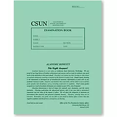

# ECON 433: Public Economics
{: .no_toc }

## Spring 2025 Syllabus
{: .no_toc }

## Table of Contents
{: .no_toc }

- TOC
{:toc}

---

## Quick Syllabus

### Professor

- Dr. Edward Kung
- edward.kung@csun.edu

### Meetings

- Section 01: 
    - Lectures: Tu 7:00pm - 8:15pm @ Bookstein 1232
	- Labs: Tu 8:30pm - 9:45pm @ Bookstein 2129 

### Office Hours

- Tu 2:30pm - 3:30pm @ Bookstein 4252 

### Course Organization

This course meets once a week, in-person. The first half of each class session will usually be a lecture, while the second half will be a lab. Attendance is checked and required.

### Grading

- **Attendance (10%)**

    Attendance in this class will be checked. Everyone starts with full credit (10 pts). You can miss one class for any reason, without penalty. Every subsequent absence will deduct 2 pts from your attendance score, to a minimum of zero.

- **Professionalism (10%)**

	I am generally very lenient and flexible with students who are showing effort. However, if you act unprofessionally, I will not hesitate to call you out on it. Examples of unprofessional behavior include: repeated tardiness, lazy effort on assignments, not paying attention in class, and leaving the class early without notifying me beforehand. Everyone starts with full credit for professionalism (10 pts), but points may be deducted for unprofessional behavior. 
    
- **Homework Assignments (20%)** 

    Weekly homework assignments will consist of one or more of the following items:
	
	- A reading assignment (textbook chapter or article).
	- A discussion assignment related to the assigned reading. The discussion will be held on Packback, an online discussion platform.
	- An online Canvas quiz.  

- **Lab Assignments (20%)**

    In-class lab sessions where you get hands-on experience working with data analysis relevant to public economics. Each lab session will require you to complete a short statistical programming assignment in-class. If you can't finish the assignment in-class, you can submit it online in Canvas as a script.
    
- **Midterm Exams (20%)**

	There will be two midterm exams that test your understanding of the course material. These will be in-person, on-paper exams that test both theoretical understanding and empirical skills.
	
- **Group Project (20%)**

    There will be a group data project. More details to follow.

- **Grading Scale**

	|  A     |  A-   |  B+   |  B    |  B-   |  C+   |  C    |  C-   |  D    |  F   |
	| :----- | :---- | :---- | :---- | :---- | :---- | :---- | :---- | :---- | :--- |
	| 100-93 | 92-90 | 89-87 | 86-83 | 82-80 | 79-77 | 76-73 | 72-70 | 69-60 | 59-0 |

	Depending on the performance of the class, a curve may or may not be applied before assigning letter grades.

- **Grading Rubric**

	| Score   | Rubric                                                                                                                             |
	| ------- | ---------------------------------------------------------------------------------------------------------------------------------- |
	|       5 | You followed all instructions. Your work is accurate and demonstrates a mastery of the material.                                   | 
	|       4 | You failed to follow all instructions OR your work has minor inaccuracies but still demonstrates an understanding of the material. |
	|       3 | Your work has major inaccuracies OR your work demonstrates only a partial understanding of the material.                           |
    |       2 | You made an attempt, but your work has major inaccuracies or does not demonstrate an understanding of the material (this includes correct answers without shown work).               |
    |       1 | You made only a partial attempt at completing the assignment; or you made an attempt but I had trouble reading or understanding it. |
    |       0 | You did not make any attempt at the assignment. Note that if you do not attempt some parts of an assignment, you may receive a zero for the whole assignment. |	

---

## Tentative Schedule

| Week | Dates         | Lecture                              | Lab                                         |  
| ---: | :------------ | :----------------------------------- | :------------------------------------------ | 
|    1 | 1/21          | Intro & Review of Micro Principles   | ~~Lab 1: Introduction to IPUMS~~                |   
|    2 | 1/28          | Public Policy Rationales             | ~~Lab 2: Introduction to R~~ Lab 1: Introduction to IPUMS                    |
|    3 | 2/4           | Economics of Education               | ~~Lab 3: Summary Statistics~~                    |
|    4 | 2/11          | Economics of Healthcare              | ~~Lab 4: Combining Datasets~~ Lab 2: Introduction to R                   |
|    5 | 2/18          | ~~Social Choice Theory~~ Lab 3: Summary Statistics                 | ~~Lab 5: Data Visualization~~ Lab 4: Combining Datasets                   |  
|    6 | 2/25          | **Midterm 1**                        | *Break*                                     |
|    7 | 3/4           | Linear Regressions I                 | Lab 6: Linear Regressions I                 |
|    8 | 3/11          | Linear Regressions II                | Lab 7: Linear Regressions II                | 
|    9 | 3/18          | **NO CLASS - SPRING BREAK**          | **NO CLASS - SPRING BREAK**                 |
|   10 | 3/25          | Research Design                      | Lab 8: Linear Regressions III               |
|   11 | 4/1           | Difference-in-Differences            | Lab 9: Difference-in-Differences            |
|   12 | 4/8           | **Midterm 2**                        | *Break*                                     |
|   13 | 4/15          | Group Project Demo                   | Group Project Meeting #1                    |
|   14 | 4/22          | ~~Economics of Home Sharing~~ Lab 5: Data Visualization            | Group Project Meeting #2                    |
|   15 | 4/29          | ~~Theory of Public Choice~~ Economics of Home Sharing              | Group Project Meeting #3                    |
|   16 | 5/6           | Group Project Meeting #4             | Group Project Meeting #4                    |

Final Exam:

- TBD

In lieu of a final exam, we will be having group project presentations.

---

## Course Description

### Prerequisites

ECON 309 and ECON 310 with a C or better. UDWPE score of 8 or higher.

### Course Overview

In the first book of Samuel in the Hebrew scriptures, the ancient Israelites demanded of the prophet Samuel, "Appoint a king to lead us, such as all the other nations have." But Samuel warned them, "He will take a tenth of your flocks, and you shall be his slaves. And in that day you will cry out because of your king, whom you have chosen for yourselves." But the people refused to listen to Samuel. "No," they said, "There shall be a king over us, that we may be like the other nations, and that our king may go out and fight our battles." (1 Sam 8:4-20) This ancient record reflects the tension that has existed between governments and their people since the beginning of human civilization. People demand a government to lead and protect them, yet we chafe under the taxes and other impositions that government places over our lives.

In this class, you will study the economics of the public sector. The public sector is the sector of the economy where goods and services are provided by the government. You will learn why some goods and services are provided by the government instead of by private suppliers. You will then study the markets with the most public sector involvement in the U.S. and investigate specific policy issues therein. By the end of the course, you will be equipped to understand and analyze a wide range of policy issues.

In today's world, policy decisions are increasingly driven by data and evidence. You will therefore also learn basic and intermediate techniques for data analysis in R, a commonly used software for statistical analysis.

### Course Learning Outcomes

By the end of the course, you will be able to:

- **Explain** what the public sector of the economy is and why there is a public sector.

- **Construct** theoretical frameworks for analyzing the positive and normative implications of various public sector issues.

- **Evaluate** the relevant empirical evidence surrounding different public sector issues.

- **Argue** for or against different policy positions using evidence drawn from social scientific research.

- **Conduct** basic data exploration and analysis operations in R.

---

## Course Materials

**Course Website**

All of the required lab materials are available for free and contained on this website.

**Packback (Required)**

The discussion assignments in this course must be completed via [Packback](https://www.packback.co), using the link provided in Canvas. You should automatically be subscribed through **MyCSUNDigitalAccess**. If for some reason you opted out or are unsubscribed, you will need to pay for a subscription.

**Textbook (Optional)**

{:width="90"}

The course is self contained based on my own materials. If you are interested in delving deeper into the subject matter, *Public Finance* by Harvey Rosen and Ted Gayer can serve as a helpful reference. However, I won't be assigning any readings or problems from the textbook.

**RStudio Cloud**

RStudio is a development environment for R. We will be using a cloud-based version of it: https://posit.cloud.

You'll need to sign up for a free account to use it.

**Assigned Readings**

Occasionally, I will assign readings from newspaper or academic journal articles. These will be posted to Canvas. You are responsible for reading these and you may be quizzed on them.

**Green Books (Required)**

You will need these for exams.

**Calculator (Required)**

You will need a calculator for this course. Any calculator is fine.

---

## Additional Course Policies and Resources

**Communications Policy**

My preferred form of communication is in-person after class or at office hours, or by email. If you email me and I do not respond within 24 hours, do not hesitate to re-send the email. Sometimes emails get lost in the shuffle.

**Late and Missing Assignment Policy**

Requests for absences, extensions, or late submissions must be submitted by email with accompanying documentation. Only unanticipated family and medical emergencies, or other extraordinary events, will be considered valid reasons. Events that could have reasonably been anticipated, such as heavy academic workload, busy work schedule, or friends' birthday parties, will not be accepted as valid reasons.

**AI Policy**

You are allowed to use AI in homework assignments to help refine your writing and your thinking. You are not allowed to copy and paste text or code directly from an AI generator.

If I suspect your work of being copy-pasted from AI, and if that is also corroborated through an AI detection tool, you will receive a reduced grade. You will receive the reduced grade even if you did not actually use AI. This is because "writing too much like AI" is itself a weakness. For example, if your cover letter on a job application looks like it was written by AI, the recruiter may think you are too lazy or disinterested to write the letter yourself.

If you are concerned about the possibility that you write too much like AI, you can run your own work through an AI detector first. 

**Academic Integrity**

By taking this course, you certify that all work is your own. Plagiarism is not allowed, and you are not allowed to have someone else do any course work in your place unless explicitly allowed by the syllabus. If it is discovered that you have violated academic integrity on any assignment, you will receive a grade of zero for that assignment. Repeated violations of academic integrity may result in a failing grade for the entire course.

**Minimum Attempt Policy**

You must at least attempt to answer every question on an assignment. If you skip a question without attempting an answer, you may receive a grade of zero for the entire assignment.

Why do I have a minimum attempt policy? Because demonstrating effort is important, especially in the workplace. Not even attempting a task is worse than attempting it and getting it wrong. I want to encourage all students to at least make an attempt at all tasks. As Wayne Gretzky said, "You miss 100% of the shots you don't take."

**Special Needs**

If you have a disability or need special accommodations, please register with the Disability Resources and Educational Services ([DRES](https://www.csun.edu/dres)) office or the National Center of Deafness ([NCOD](https://www.csun.edu/ncod)). If you would like to discuss your need for accommodations with me, please contact me to set up an appointment.

Special consideration may be given to students with caregiving responsibilities at home (children, disabled family members, etc.). Please get in touch with me if you need an extension and have caregiving responsibilities.

**Emergency Food and Shelter**

If you are experiencing an emergency need for food or shelter, do not hesitate to utilize the resources available to you on campus. More information: https://www.csun.edu/heart.

**University Counseling Services**

If you have need for counseling regarding any personal or academic issues, do not hesitate to reach out to the University's counseling services. More information: https://www.csun.edu/counseling/students.

**Diversity Statement**

It is my intent that students from diverse backgrounds and perspectives will be well served by this course, that students' learning needs will be addressed both in and out of the classroom, and that the diversity students bring to the class will be viewed as a resource, strength, and benefit. It is my intent to present materials and activities in a way that is respectful to students from all backgrounds, and that students from all backgrounds have an equal opportunity to succeed in the course. If you have any concerns, feel free to reach out to me.

**All Other Policies**

In general, the course follows all relevant CSUN policies and procedures as documented here: https://catalog.csun.edu/policies/alphabetical. Please pay special attention to the rules on **attendance** and **academic dishonesty**.

