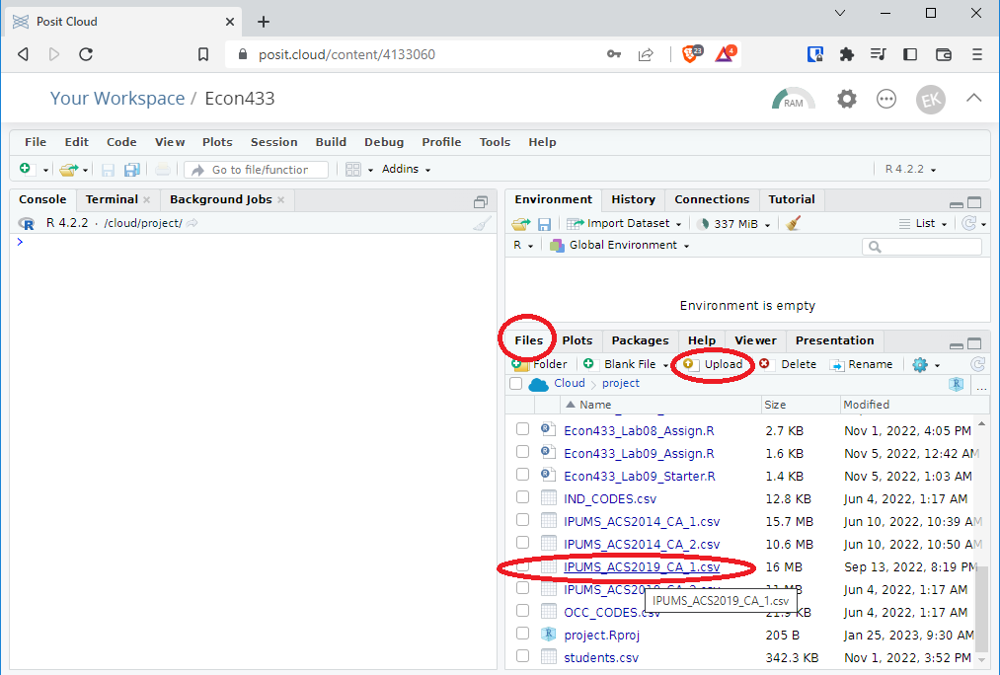
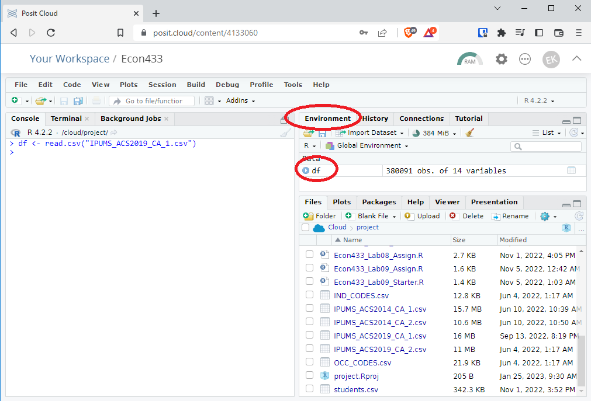
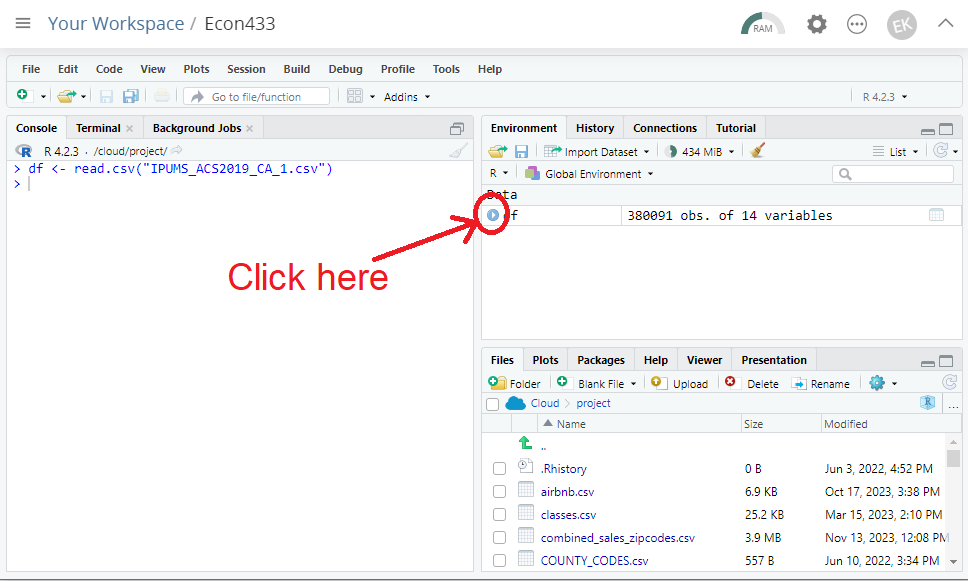
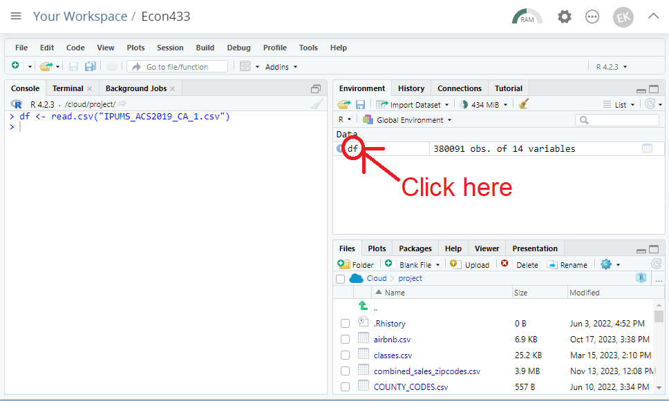

# ECON 433 - Lab Session 2
## Introduction to R

In this lab you will be introduced to R, a programming language designed specifically for statistical analysis. 

**Why R?**

- Working with data can involve a complex series of steps. Writing a set of instructions as code makes the process more reproducible and easier to share with others. 

- R is open source software, meaning it is free for anyone to use. It also has a large and active community of developers.

- Data science is an in-demand skill. R is one of the most commonly used tools among data scientists (along with Python). An ad-tech company manager looking to hire econ masters students once told me that they're only looking for interns who can work in R or Python. Excel was not sufficient. 

**Data science? I thought this was an economics class.**

Yes, it is an economics class. But the study of economics (including public economics) is becoming more and more data driven. Economists, if they are equipped with the right empirical skill set, are well positioned to make impactful contributions to their organizations by combining solid economic theory with compelling statistical evidence.

## Lab Work 

In this lab, you will download a data file that I have downloaded in advance from IPUMS. You will load the data file into R and conduct some basic data exploration tasks. 

### R Studio Cloud

1. First, you will need to create a R Studio Cloud account. Go to https://posit.co/products/cloud/cloud and sign up for a "Cloud Free" account.

2. Log in and click on "Your Workspace" on the left. Click on "New Project" -> "New RStudio Project".  

3. Name the project whatever you want. Suggestion: "Econ 433".

### Upload the data

4. Download `IPUMS_ACS2019_CA_1.csv` from Canvas. This is an IPUMS data extract containing data from the 2019 ACS for the state of California, similar to what you extracted in Lab 01.

5. In R Studio, click the "Upload" button under the "Files" tab, as shown in the screenshot, and upload `IPUMS_ACS2019_CA_1.csv`. You should now see it in your files list.

    

### Load the data into the work environment

6. In the console, type `df <- read.csv("IPUMS_ACS2019_CA_1.csv")` and hit enter. This loads the CSV file into a dataframe called `df`. You should see it appear in the "Environment" tab.

    

### Check the column names and data types

7. Click the blue arrow next to `df` on the "Environment" tab. This opens up a list of all the columns in the dataframe. It shows you the name of each column, the data type, and the first few rows of that column. (More on data types later).

    *Note: We sometimes also refer to columnns as variables.*

    

### View the data

8. Click on the words `df` in the "Environment" tab. This opens up a table viewer. You can scroll around and look at the data like you would in Excel. You can exit the Viewer by clicking the little "x" on the Viewer tab.

    

### Working with the employment variable

The variable `EMPSTAT` shows the person's employment status. According to [IPUMS codebook](https://usa.ipums.org/usa-action/variables/EMPSTAT#codes_section), `EMPSTAT` has the following codes:

| `EMPSTAT` | Meaning            |
| --------- | ------------------ |
| 0         | N/A                |
| 1         | Employed           |
| 2         | Unemployed         |
| 3         | Not in labor force |

9. Type `table(df$EMPSTAT)`. This shows you a table with the number of rows with each possible value of `EMPSTAT`. How many rows have `EMPSTAT==1`? How many have `EMPSTAT==2`?

Sometimes, it's more convenient to work with binary indicators for a person's employment status. So let's create some True/False variables that indicate whether the person is employed, unemployed, or not in the labor force.

10. Type `df$EMPLOYED <- df$EMPSTAT==1`. This creates a new variable called `EMPLOYED` that is `TRUE` when the person is employed and `FALSE` otherwise.

11. Type `df$UNEMPLOYED <- df$EMPSTAT==2`. This creates a new variable called `UNEMPLOYED` that is `TRUE` when the person is unemployed and `FALSE` otherwise.

12. Type `df$NLF <- df$EMPSTAT==3`. This creates a new variable called `NLF` that is `TRUE` when the person is not in the labor force and `FALSE` otherwise.

13. Look at the column data types by clicking the blue arrow. `df` now contains three additional columns with a data type of "logical". (More on this later.)

14. Type `table(df$EMPLOYED)`. How many rows are employed?

### Working with the age variable

The variable `AGE` shows a person's age. The number itself is the age, so there aren't any codes. Sometimes, we might want to create indicators for different stages of life.

15. Type `df$CHILD <- df$AGE<=18`. This creates a new variable called `CHILD` that is `TRUE` when the person is 18 or younger and `FALSE` otherwise.

16. Type `df$ADULT <- (df$AGE>18) & (df$AGE<=65)`. This creates a new variable called `ADULT` that is `TRUE` when the person is over 18 but 65 or younger, `FALSE` otherwise.

    *Note: The `&` here means "and". It's a logical operator. (More on logical operators below.)*

17. Type `df$SENIOR <- df$AGE>65`. This creates a new variable called `SENIOR` that is `TRUE` when the person is over 65 and `FALSE` otherwise.

### Working with the income variable

The variable `INCWAGE` shows a person's annual wage and salary income. The number itself is the income, with one caveat. According to the [IPUMS codebook](https://usa.ipums.org/usa-action/variables/INCWAGE#codes_section), a value of `999999` (six 9s) indicates N/A and a value of `999998` (five 9s and a 8) indicates missing data.  For now, we'll ignore this. (We'll learn how to filter out bad data in the next lab).

With numerical variables like income, we're sometimes interested in statistics like the mean and standard deviation.

18. Type `mean(df$INCWAGE)`. This will show you the average of `INCWAGE` across all the rows.

    *Note: This is not the true average across people because the data is weighted. We'll learn how to calculate weighted averages later.*
   
19. Type `median(df$INCWAGE)`. This will show you the median of `INCWAGE` across all the rows.
    
20. Type `sd(df$INCWAGE)`. This will show you the standard deviation of `INCWAGE` across all the rows.

21. Type `summary(df$INCWAGE)`. This will report a table of summary statistics, including the minimum, 25th percentile, median, mean, 75th percentile, and maximum.

Don't make too much of these statistics for now, since they are not being calculated using sample weights. You'll learn how to calculate statistics with sample weights in a future lab.

### Working with the race variable

The variable `RACE` shows a person's race. According to the [IPUMS codebook](https://usa.ipums.org/usa-action/variables/RACE#codes_section), it has the following codes:

| `RACE`  | Meaning                                     |
| ------- | ------------------------------------------- |
| 1       | White                                       |
| 2       | Black / African American                    |
| 3       | American Indian or Alaska Native            |
| 4       | Chinese                                     |
| 5       | Japanese                                    |
| 6       | Other Asian or Pacific Islander             |
| 7       | Other race, nec                             |
| 8       | Two major races                             |
| 9       | Three or more major races                   |

Note that for historical reasons, the classification as Hispanic is separate as the classification for race. Hispanic status is contained in the `HISPAN` variable, which according to the [IPUMS codebook](https://usa.ipums.org/usa-action/variables/HISPAN#codes_section) has the following codes:

| `HISPAN` | Meaning                |
| -------- | ---------------------- |
| 0        | Not Hispanic           |
| 1        | Mexican                |
| 2        | Puerto Rican           |
| 3        | Cuban                  |
| 4        | Other                  |
| 9        | Not reported           |

Let's create indicator variables for five major race categories: `WHITE`, `BLACK`, `HISPANIC`, `ASIAN`, and `OTHER`.

22. Type `df$WHITE <- df$RACE==1`. This creates the variable for whether the person is white.

23. Type `df$BLACK <- df$RACE==2`. This creates the variable for whether the person is black.

24. Type `df$HISPANIC <- (df$HISPAN>0) & (df$HISPAN<9)`. This creates the variable for whether the person has Hispanic origin.

25. Type `df$ASIAN <- (df$RACE>=4) & (df$RACE<=6)`. This creates the variable for whether the person is Asian.

26. Type `df$RACE_OTHER <- (df$RACE==3) | (df$RACE>6)`. This creates the other category, which contains the non-white, non-black, and non-Asian races.

    *Note: The `|` means "or". It's another logical operator. (More on logical operators below.)*
    
## Assignment

Complete the following tasks:

1. Create a variable called `WORKING_ADULT` which is `TRUE` if the person is employed and between the ages of 25 and 65.

2. Create a variable called `MARRIED` which is `TRUE` if the person is married (whether spouse is present or not). Hint: You'll need to look at the [IPUMS codebook](https://usa.ipums.org/usa-action/variables/MARST#codes_section) for `MARST`.

3. Create a variable called `WORKING_MARRIED_MAN` if the person is male, married, and employed. (There is no age restriction for this variable).

4. Create a variable called `UNDER_REPRESENTED` if the person's race is black, hispanic, or other (using the definitions listed above).

To be dismissed, show me the output of the following commands and take the lab quiz:

- `table(WORKING_ADULT)`
- `table(MARRIED)`
- `table(WORKING_MARRIED_MAN)`
- `table(UNDER_REPRESENTED)`

## Takeaways

- You can use R Studio Cloud.
- You can do basic tasks in R, including:
    - Load data from files
    - View data
    - Summarize data
    - Reference  variables with `$`
    - Create new variables with `<-`
	- Use logical operators to make `TRUE`/`FALSE` variables
- You understand the concept of data types.

## Reference Guide

### Data Types

**Data type** is a very important concept in data science. Each column (or variable) has its own data type. The data type tells R what kind of data the variable is meant to represent.

Common data types include:

| Data Type                | Meaning                                                             | Examples                             |
| ------------------------ | ------------------------------------------------------------------- | ------------------------------------ |
| Integer                  | Positive or negative number, but no decimals                        | -5, 0, 4, 100                        |
| Numeric                  | Numbers that may include decimals                                   | 3.1415, 2.27, 65000, -130            |
| Boolean (aka Logical)    | `TRUE` or `FALSE` (`TRUE` can be represented by 1 and `FALSE` by 0) | `TRUE`, `FALSE`, 1, 0                |
| String                   | Text                                                                | "Edward", "Economics", "Los Angeles" |
| Date                     | A date or time                                                      | `1/1/2024`, `4/15/1984 13:45:00`     |
| Categorical (aka Factor) | A variable that can be one of a fixed number of possibilities       | `WHITE`, `BLACK`, `HISPANIC`, `ASIAN`, or `OTHER` |

Data types are important because they tell R how the data should be handled in different situations.

For example, integer and numeric data can be added, subtracted, multiplied, divided, and compared. Dates, however, can only be subtracted to get the number of days between two dates. Strings and categoricals cannot be added, subtracted, multipled, or divided at all.

### Boolean Variables and Logical Operators

Boolean variables represent statements that can be `TRUE` or `FALSE`, `1` or `0`. They are also sometimes called "logical variables", "binary variables", "binary indicators", "dichotomous variables".

Boolean variables cannot be added, subtracted, multiplied, or divided. However, they can be combined using **logical operator**. A logical operator is something that combines two pieces of data and outputs `TRUE` or a `FALSE`.

The logical operators you should know are:

- `>` and `>=`: greater than / greater than or equal to
- `<` and `<=`: less than / less than or equal to
- `==`: exactly equal to
- `!=`: not equal to
- `&`: and
- `|`: or

    

