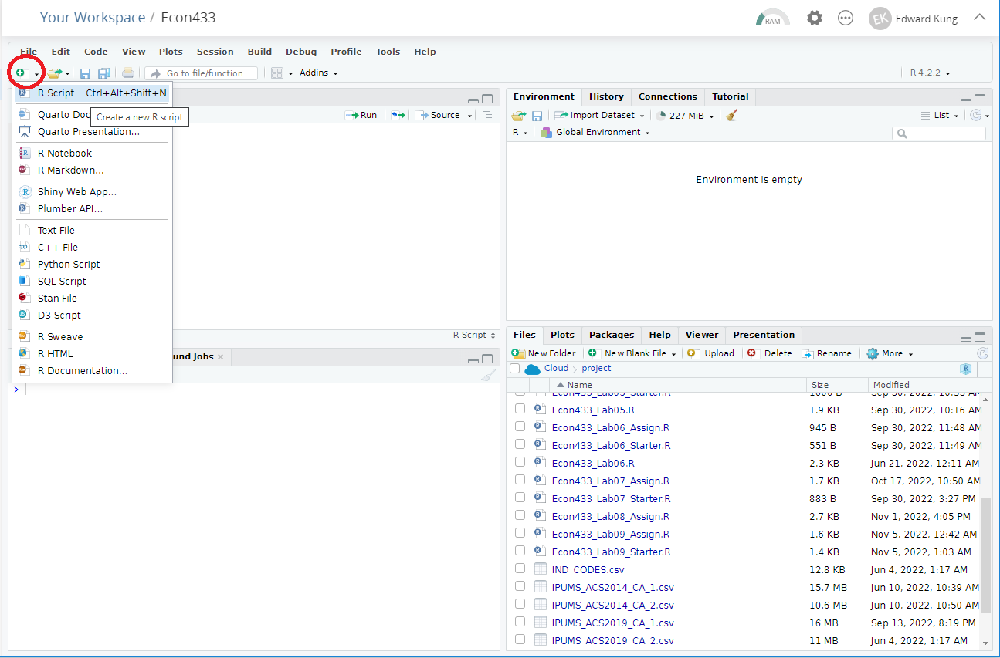
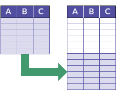

# ECON 433 - Lab Session 3
## Basic Data Operations and Scripts

In this lab you will learn how to perform some basic data operations in R and how to work with scripts.

## Lab Work

### Setup

For today's lab, you will need the following files which can be downloaded from Canvas.

- `IPUMS_ACS2014_CA_1.csv`
- `IPUMS_ACS2014_CA_2.csv`
- `IPUMS_ACS2019_CA_1.csv`
- `IPUMS_ACS2019_CA_2.csv`

These files contain ACS data extracts downloaded from IPUMS for the state of California in 2014 and 2019. The files labeled `_1` and `_2` contain different information. In the lab, we will learn how to combine these separate files together into one dataframe.

For today's lab, you will also need to install a **package** in R called `dplyr`. To do so, type `install.packages("dplyr")` in your R console. (You might be asked to restart R, simply say no.) This step installs the package called `dplyr` to R, but you still have to load it into your current work environment. To do so, type `library(dplyr)` in the console.

**Packages** - A *package* in R is a collection of functions and tools that expands R's baseline functionality. Packages are written by authors and developers from all over the world and made available for free on [CRAN](https://cran.r-project.org/) (the Comprehensive R Archive Network). 

**dplyr** - `dplyr` is one of the most popular and important packages in R. It stands for "data pliers" and contains many tools to make data processing tasks easier. Many of the functions we use in this lab are from `dplyr`.

### Scripts

A **script** is simply a file that contains a set of instructions. When R "runs a script", it simply executes the instructions contained in the file one-by-one, starting at the top and moving line-by-line to the bottom. R scripts are designed with the file extension `.R`.

To start a new R script, click the button with the green plus on the top-left corner, as shown in the screenshot below. Then select "R Script" from the dropdown menu. A script editor window should appear. You will write your script in this window.

### My First Script

To write your first script, enter the following into the script editor. Then save it by hitting `CTRL+S` or by using the icons or menus. You can name the script anything you like, but the filename should end in `.R`. Suggested filename: `my_script.R`. 

    rm(list=ls())  # Resets the workspace so you can start fresh
    library(dplyr) # Loads the dplyr library
    
    df <- read.csv("IPUMS_ACS2019_CA_1.csv")  # Load the data
    
    df$EMPSTAT <- as.factor(df$EMPSTAT)  # Change EMPSTAT to a factor
    
    table(df$EMPSTAT)  # Show a frequency table for EMPSTAT

Once you've entered this script into the script editor and saved it, hit `CTRL+SHIFT+ENTER` to run the entire script. You should see the following output in your console window:

         0      1      2      3 
     66593 182239   9218 122041 

Instead of running the whole script at once, you can also execute lines of code one at a time. This is useful when developing a new script or when debugging. To execute a single line of code, click on that line of code in the editor window so that the cursor shows up on that line. Then hit `CTRL+ENTER`. R will run that single line of code. Try it by clicking on the `rm(list=ls())` line then hitting `CTRL+ENTER`. It should reset your workspace.

You can continue to hit `CTRL+ENTER` to continue excuting your code line-by-line. This is known as "stepping through" your code and it's very helpful for debugging.

### Anatomy of a Script

Let's take a look at a few important elements of the script.

The first line of the script is

    rm(list=ls())   # Resets the workspace so that you can start fresh
    
The command `rm(list=ls())` deletes everything in your current workspace. (It doesn't delete files, only objects which have been temporarily loaded into R's memory.) It's a good idea to start every script with `rm(list=ls())` so that you start with a fresh working environment. If you don't start fresh, then objects currently existing in R's temporary memory may affect the processing of your script, leading to unexpected behavior.

`rm(list=ls())` is followed by `# Resets the workspace so that you can start fresh`. This is known as a **comment**. Programmers put comments in their code to help explain what a particular piece of code does. To make a comment in R, put the comment at the end of a line of code and precede it with the hashtag symbol `#`.

The next line of code is `library(dplyr)`. This loads the package `dplyr` into your workspace. It's standard practice to load all your script's required packages at the start of the script.

The next three lines of code are things you've already seen in Lab 02. First, the CSV file is loaded into a dataframe called `df`. Then, the `EMPSTAT` variable is converted to a factor. Finally, a frequency table for `EMPSTAT` is shown.

### Filtering

If you look at the frequency table for `EMPSTAT` and consult the [IPUMS codebook](https://usa.ipums.org/usa-action/variables/EMPSTAT#codes_section), you will see that our data has a very large number of people not in the labor force (`EMPSTAT=3`). This is because the data contains not only working age adults, but also children and senior citizens.

Suppose we are interested only in working age adults, which we define as people between the ages of 25 and 65. We want to remove anyone outside this range from our data. How can we do that?

The `filter` function from `dplyr` lets us keep or remove rows based on whether or not they meet a condition. This process is known as **filtering**. You can think of it as passing the data through a filter, so some rows are filtered out and some are allowed to pass through.

Add the command `df <- filter(df, AGE>=25 & AGE<=65)` to your script, right after you load the data. The filter command takes as its arguments the dataframe you want to filter, `df` in this case, and then the condition you want to filter on, in this case `AGE>=25 & AGE<=65`. The `&` symbol means "and", so we want to keep rows where `AGE>=25` AND `AGE<=65`.

The final script should look like this: 

    rm(list=ls())  # Resets the workspace so you can start fresh
    library(dplyr) # Loads the dplyr library
    
    df <- read.csv("IPUMS_ACS2019_CA_1.csv")  # Load the data
    
    df <- filter(df, AGE>=25 & AGE<=65)  # Keep only working age adults
    
    df$EMPSTAT <- as.factor(df$EMPSTAT)  # Change EMPSTAT to a factor
    
    table(df$EMPSTAT)  # Show a frequency table for EMPSTAT
    
Run the whole script from the top by hitting `CTRL+SHIFT+ENTER`. Your output should look like:

         1      2      3 
    150966   6281  48005 

Notice that the number of observations that are not in the labor force dropped significantly. And the number of observations with `EMPSTAT=0` dropped entirely, now that we are filtering on working-age adults.

### Appending

Currently, we are using the file `IPUMS_ACS2019_CA_1.csv`, which contains data from California in 2019 only. What if we wanted to add data from other years or other states?

Dataframes can be combined vertically using the R command `rbind`. This is a procedure known as **appending**. In order to append two datasets together, they need to have the same columns. The image below illustrates the append operation. Appending is useful when the data rows you need are split into multiple files

Now let's create a dataframe which appends `IPUMS_ACS2019_CA_1.csv` with `IPUMS_ACS2014_CA_1.csv`. The resulting dataframe will have California data for both 2014 and 2019. In your script, replace `df <- read.csv("IPUMS_ACS2019_CA_1.csv")` with

    df2014 <- read.csv("IPUMS_ACS2014_CA_1.csv")
    df2019 <- read.csv("IPUMS_ACS2019_CA_1.csv")
    df <- rbind(df2014, df2019)
    
This block of code loads the 2014 data into `df2014`, the 2019 data into `df2019`, then appends the two dataframes into a new dataframe called `df`.

Re-run your entire script from the top (including the filtering operation). Your frequency table for `EMPSTAT` should now look like:

         1      2      3 
    290189  16657  99655 

Also try tabulting the years with `table(df$YEAR)`. You should get:

      2014   2019 
    201249 205252 

### Merging

Now we are using the data files labeled `_1` for both 2014 and 2019. These files contain information about basic demographics like age, race, sex, and basic work information like employment status and wages. But what if we want other information, like educational attainment, that's contained in a separate file? To add that data to our dataframe we need to perform an operation known as **merging**.

**Merging** data means combining data horizontally. That is, for the same set of observations (rows) in one dataframe you attach new columns from another dataframe. This is useful when the data columns you need are split into multiple files. The image below illustrates the merging operation.

**Key variables**. In order to merge, you must merge on one or more *key variables*. The key variable should be a **unique identifier** for each row in both dataframes. That is, no two rows should have the same combination of values for the key variables.[^1] As mentioned in Lab 02, the unique identifiers for the ACS data are `SERIAL` and `PERNUM`. If we include data from different years, we also have to include `YEAR` as a key variable. So our key variables will be `YEAR`, `SERIAL`, and `PERNUM`.

There are four different merge commands in R: `inner_join`, `left_join`, `right_join`, and `full_join`. The difference between them is how they deal with rows for which matching keys are not found in either the left or the right dataframe. (Left and right is simply the terminology for the two dataframes being merged.) 

**Inner join**. In an inner join, only rows where the keys are found in both the left and right dataframes are included in the merged dataframe.

**Left join**. In a left join, all rows in the left dataframe are kept, even if their keys are not found in the right dataframe. Rows without keys in the right dataframe will have missing values for columns coming from the right dataframe. Rows without keys in the left dataframe are tossed.

**Right join**. In a right join, all rows in the right dataframe are kept, even if their keys are not found in the left dataframe. Rows without keys in the left dataframe will have missing values for columns coming from the left dataframe. Rows without keys in the right dataframe are tossed.

**Full join**. In a full join, all rows from both dataframes are kept. Rows without keys in either the left or the right dataframe will have missing values for the corresponding columns.

The image below illustrates the four types of merges. I recommend only using inner joins or left joins and never right joins or full joins unless you already have a very deep understanding of your data.

### Merging the IPUMS data

Now let's merge the two IPUMS datasets for California in 2019. We will use `inner_join` because we know that the keys are the same in both datasets. Run the following script:

    rm(list=ls())  # Clear the workspace
    library(dplyr) # Load dplyr
    
    # Load and join the 2019 data
    df2019_1 <- read.csv("IPUMS_ACS2019_CA_1.csv")
    df2019_2 <- read.csv("IPUMS_ACS2019_CA_2.csv")
    df <- inner_join(df2019_1, df2019_2, by=c("YEAR","SERIAL","PERNUM"))
    
    # Show the structure of the data
    str(df) 
    
Note that the key variables are supplied to `inner_join` via the argument `by`, and the key variables are inputted as a list of variable names. (In R, `c(...)` creates a list of terms.) 

If you run the script, you should see that `df` has 38,0091 rows and 19 columns.

## Assignment

To be dismissed and earn your grade for this lab, you have to debug the following script:

    rm(list=ls())
    library(dplyr)
    
    df2019_1 <- read.csv("IPUMS_ACS2019_CA_1.csv")
    df2019_2 <- read.csv(IPUMS_ACS2019_CA_2.csv)
    df <- inner_join(df2019_1, df2019_2, by=(YEAR,SERIAL,PERNUM))
    
    df2014_1 <- read.csv("IPUMS_ASC2014_CA_1.csv")
    df2014_2 <- read.csv(IPUMS_ACS2014_CA_2.csv)
    df <- inner_join(df2014_1, df2014_2, by=(YEAR,SERIAL,PERNUM)
    
    df <- rbind(df2014 df2019)
    
    df <- filter(df, AGE>=25 & AGE<=65 & MARST=1)
    
    str(df)

The script is supposed to:

1. Merge the two 2014 files
2. Merge the two 2019 files
3. Append the resulting 2014 and 2019 dataframes together
4. Filter on working-age, married (with spouse present), men (Hint: To write a condition that checks whether a variable is equal to a value, use the double equals sign `==`, e.g. `MARST==1`)
5. Show the structure of the data

However, the script has errors. You have to fix the script so that it runs and accomplishes its tasks accurately. 

Show me the script and its output, then take the lab quiz, to be dismissed.

## Takeaways

- You can write R scripts.
- You can perform the following data operations in R:
  - Filtering
  - Appending
  - Merging
- You know the different types of joins.

[^1]: There are more complex merges in which one of the dataframes can have multiple rows with the same keys. These are called many-to-one or one-to-many merges. These merges should be avoided unless the researcher already has a deep understanding of the datasets.

 
