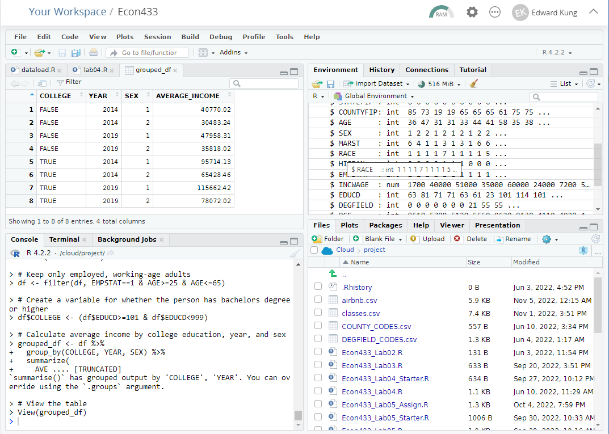

# Econ 433 - Lab Session 4
## Computing Group Summary Statistics

In this lab you will learn how to calculate summary statistics based on different groups in your data. This would allow you to calculate, for example, average income for college vs. non-college educated workers in California in 2014 and 2019.

## Lab Work

### Setup

For today's lab you will need the following files. They should already be uploaded to the cloud from the last lab. If they aren't, you should download these files from Canvas and upload them.

- `IPUMS_ACS2014_CA_1.csv`
- `IPUMS_ACS2014_CA_2.csv`
- `IPUMS_ACS2019_CA_1.csv`
- `IPUMS_ACS2019_CA_2.csv`

For today's lab you will also need the package `dplyr`. This should already be installed from the last lab so you shouldn't need to install it again. If you do need to install it again, you can install it with the command `install.packages("dplyr")` from the console.

### Creating a Data Load Script

In Lab 03, you created a script that (1) Loads and merges the two 2014 files, (2) Loads and merges the two 2019 files, and (3) appends them together. Today, we will see how we can re-use scripts that you wrote previously.

Create a new script that contains the following code:

    # Load and merge the two data files for 2014
    df2014_1 <- read.csv("IPUMS_ACS2014_CA_1.csv")
    df2014_2 <- read.csv("IPUMS_ACS2014_CA_2.csv")
    df2014 <- inner_join(df2014_1, df2014_2, by=c("YEAR","SERIAL","PERNUM"))
    
    # Load and merge the two data files for 2019
    df2019_1 <- read.csv("IPUMS_ACS2019_CA_1.csv")
    df2019_2 <- read.csv("IPUMS_ACS2019_CA_2.csv")
    df2019 <- inner_join(df2019_1, df2019_2, by=c("YEAR","SERIAL","PERNUM"))
    
    # Append the dataframes from 2014 and 2019
    df <- rbind(df2014, df2019)
    
    # Clean up no longer needed dataframes
    rm(df2014_1, df2014_2, df2014, df2019_1, df2019_2, df2019)
    
Save this script as `dataload.R`.

`dataload.R` is a script that loads the entire 2014 and 2019 ACS data and puts it in a dataframe called `df`. The last line of the script removes the temporary dataframes that we used to create `df`. Since we won't be needing them after creating `df`, we remove them to keep our working environment tidy. 

The purpose of saving `dataload.R` as its own script is that we can now re-use this data loading procedure in other scripts without having to re-write the entire 

### Calling a Script from Another Script

The purpose of having `dataload.R` as its own script is that we can now re-use this procedure in other scripts without having to re-write it each time. To call a script from another script, we use the command `source("<NAME OF SCRIPT>")`. 

Try it out with the following script, which calls `dataload.R`:

    rm(list=ls())  # Clear the workspace
    library(dplyr) # Load dplyr
    
    source("dataload.R")  # Load the data
    
    str(df)  # Show the structure of the data
    
Run this script from the top with `CTRL+SHIFT+ENTER`. You should get output showing that `df` has 752644 rows and 19 columns.

Now that we've written `dataload.R`, any time we need to work with the entire 2014 and 2019 ACS data, we can simply call `dataload.R` and get the data with one command.

### Calculating Group-Based Summary Statistics

A common task in data analysis is to compute summary statistics for different groups within your data. For example, we may be interested in calculating the average income for college and non-college educated workers. We may further want to break that down by male and female, or by year, or by geographic location. There are many different ways to cut the data, each of which can yield different insights. 

The following script shows an example for how we calculate average income of employed workers by college education, year, and sex, using our ACS data from California in 2014 and 2019.

    rm(list=ls())    # Clear the workspace
    library(dplyr)   # Load dplyr
    
    source("dataload.R")   # Load the data
    
    # Keep only employed, working-age adults
    df <- filter(df, EMPSTAT==1 & AGE>=25 & AGE<=65)
    
    # Create a variable for whether the person has bachelors degree or higher
    df$COLLEGE <- (df$EDUCD>=101 & df$EDUCD<999)
    
    # Calculate average income by college education, year, and sex
    grouped_df <- df %>% 
      group_by(COLLEGE, YEAR, SEX) %>%
      summarize(
        AVERAGE_INCOME = weighted.mean(INCWAGE, PERWT)
      )
    
    # View the table
    View(grouped_df)

You should get output that looks like the following image. What do you notice about the relative income of the college vs. non-college educated? What do you notice about the differences between men and women? How about between the years 2014 and 2019?

Now let's walk through the script to see what each line of code does.

1. The first few lines of code are boilerplate. `rm(list=ls())` clears the workspace, which we should do at the start of every new task. `library(dplyr)` loads the required `dplyr` library.

2. `source("dataload.R")` is the script we created to cobble together the four data files into one dataframe.

3. `df <- filter(df, EMPSTAT==1 & AGE>=25 & AGE<=65)` filters the data on employed individuals (`EMPSTAT==1`) and working-age individuals (`AGE>=25` and `AGE<=65`).

4. `df$COLLEGE <- (df$EDUCD>=101 & df$EDUCD<999)` creates a new variable called `COLLEGE`. This variable is a **boolean** variable, meaning it can be either `TRUE` or `FALSE`. The truth value of `COLLEGE` is defined as being equal to the truth value of `(df$EDUCD>=101 & df$EDUCD<999)`. That is, `COLLEGE` is equal to `TRUE` if `EDUCD` is greater than or equal to 101 and strictly less than 999. The IPUMS codes for the `EDUCD` variable is shown [here](https://usa.ipums.org/usa-action/variables/EDUC#codes_section) (under "detailed codes"). From these codes, we see that a value of 101 indicates that the individual has achieved a bachelor's degree, and that higher values indicate higher levels of education, until the value of 999 which indicates that the data is missing. So to interpret `COLLEGE` in words: it is an indicator for whether the individual has attained a bachelor's degree or higher.

5. The next command is a single command spread out over multiple lines:

        grouped_df <- df %>%
          group_by(COLLEGE, YEAR, SEX) %>% 
          summarize(
            AVERAGE_INCOME = weighted.mean(INCWAGE, PERWT)
          )
          
    There is a lot to talk about in this command, so we will go over it slowly.
    
    

