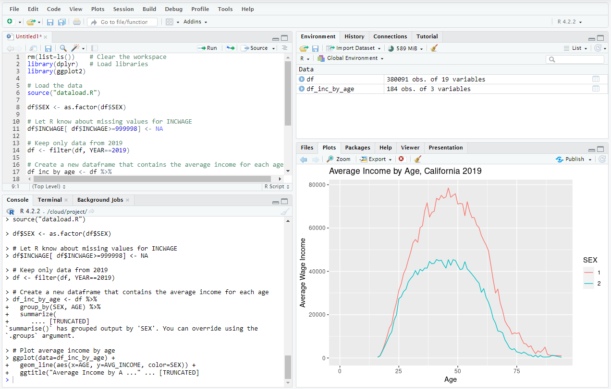

# ECON 433 - Lab Session 6
## Data Visualization

In this lab you will learn how to create some simple charts in R. You will learn about how to create line plots, bar charts, and scatter plots. 

In the process, you will also learn about missing values and factor labels.

## Lab Work

### Setup

For today's lab you will need the following files. They should already be uploaded to the cloud from previous labs. If they aren't, you should download these files from Canvas and upload them. 

- `IPUMS_ACS2014_CA_1.csv`
- `IPUMS_ACS2014_CA_2.csv`
- `IPUMS_ACS2019_CA_1.csv`
- `IPUMS_ACS2019_CA_2.csv`

You will also need a new file:

- `DEGFIELD_CODES.csv`

Download this file from Canvas and upload it to the cloud.

For today's lab you will also need the packages `dplyr` and `ggplot2`. `dplyr` should already be installed from previous labs. If it isn't, install it with `install.packages("dplyr")`. Also install `ggplot2` with `install.packages("ggplot2")`. `ggplot2` is the standard library for creating charts in R.

Finally, you should have the script `dataload.R` from Lab 04.

Make sure all these files are in your working directory before beginning.

### Line Plots

A line plot is used to show the relationship between two numerical variables. Use line plots when there is only one value of Y for each value of X. Example: How does average income change with age?

The following script creates a line plot showing how average income changes with age, using the 2019 ACS data.

    rm(list=ls())    # Clear the workspace
	library(dplyr)   # Load libraries
	library(ggplot2) 
	
	# Load the data
	source("dataload.R")  
	
	# Let R know about missing values for INCWAGE 
	df$INCWAGE[ df$INCWAGE>=999998] <- NA
	
	# Keep only data from 2019
	df <- filter(df, YEAR==2019)
	
	# Create a new dataframe that contains the average income for each age 
	df_inc_by_age <- df %>% 
	  group_by(AGE) %>% 
	  summarize(
	    AVG_INCOME = weighted.mean(INCWAGE, PERWT, na.rm=TRUE)
	  )

    # Plot average income by age 
    ggplot(data=df_inc_by_age) + 
      geom_line(aes(x=AGE, y=AVG_INCOME)) + 
      ggtitle("Average Income by Age, California 2019") +
      xlab("Age") + 
      ylab("Average Wage Income")
	  
Run the script from the top (`CTRL+SHIFT+ENTER`) and you should see a line plot in the "Plots" window as shown in the screenshot below:

Let's walk through each element of this script.

1. The first few lines of code are boilerplate. We clear the workspace, load the required libraries (`dplyr` and `ggplot2`), and load the data using `dataload.R` which we wrote in Lab 04.

2. The next line of code is `df$INCWAGE[ df$INCWAGE>=999998] <- NA`. This line of code is rather complex to understand, so let's walk through it slowly.

    Overall, the purpose of this line of code is to tell R how to deal with missing values for the variable `INCWAGE`. The [IPUMS codebook](https://usa.ipums.org/usa-action/variables/INCWAGE#codes_section) tells us that when `INCWAGE` is 999998 or 999999, that means `INCWAGE` is either not applicable or unknown. Since we are going to be computing the average income by age, we don't want to include these values of 999998 or 999999 in our averages. We need to tell R that these values shouldn't be treated as numbers, but rather missing values.

    `df$INCWAGE[ df$INCWAGE>=999998] <- NA` accomplishes this. First, let's look at `df$INCWAGE[ df$INCWAGE>=999998]`. This part of the code uses the pattern `df$X[CONDITION]`, which selects only the rows of `df$X` for which `CONDITION` is true. So `df$INCWAGE[df$INCWAGE>=999998]` selects the rows of `df$INCWAGE` for which `df$INCWAGE>=999998`. If you typed `length(df$INCWAGE[df$INCWAGE>=999998])` in the console, you would get an output of `66593` showing that there are 66,593 rows with `INCWAGE>=999998`. 
	
	`df$INCWAGE[df$INCWAGE>=999998]` selects the rows of `df$INCWAGE` for which `df$INCWAGE>=999998`. Then, the part of the code that says `<- NA` assigns the value of `NA` to those rows. `NA` is the symbol that R uses to denote missing values. We therefore replace any values of `999998` and `999999` in `INCWAGE` with the symbol `NA`. Later, when we compute the group-based averages, we can tell R to ignore the missing values. 
	
	The practice of selecting certain rows of a variable is known as **indexing**. It is useful when you want to apply an operation to only a subset of the rows, but you don't want to filter the entire dataset. 
	
3. The next line of code, `df <- filter(df, YEAR==2019)` keeps only the data from 2019.

4. The next few lines of code are:

        df_inc_by_age <- df %>% 
		  group_by(AGE) %>% 
		  summarize(
		    AVG_INCOME = weighted.mean(INCWAGE, PERWT, na.rm=TRUE)
		  ) 
		  
    This command creates a new dataframe called `df_inc_by_age` where `AGE` is the primary key and there's a column called `AVG_INCOME` which is equal to the weighted mean of `INCWAGE` averaged over people of a specific age. The `na.rm=TRUE` argument in `weighted.mean` tells R to ignore all values of `NA` when calculating the weighted mean of `INCWAGE`. 
	
5. The last few lines of code are:

        ggplot(data=df_inc_by_age) + 
		  geom_line(aes(x=AGE, y=AVG_INCOME)) + 
          ggtitle("Average Income by Age, California 2019") +
          xlab("Age") + 
          ylab("Average Wage Income")
	
	This command makes the line plot and displays it to the "Plots" pane. Let's take a look at each element of this command:

    `ggplot(data=df_inc_by_age)`: In `ggplot2`, plots are started by calling `ggplot` with the dataframe containing the data to plot as the `data` argument. This initializes an empty chart. 
	
	To add elements to the chart, we use the `+` symbol. We can start a new line after the `+` symbol. R knows to look for the next element on the next line.
	
	The next element is the line plot itself: `geom_line(aes(x=AGE, y=AVG_INCOME))`. Calling `geom_line` initializes a line plot. `aes(x=AGE, y=AVG_INCOME)` is passed to `geom_line` as an argument, and it tells `geom_line` to use the values for `AGE` on the X axis and the values for `AVG_INCOME` on the Y axis. The dataframe you passed into `ggplot` must contain these variables for it to work. 
	
	The next elements are decorative elements. `ggtitle` lets us tell R what to use for the title of the plot. `xlab` tells R what to use for the X axis label and `ylab` tells R what to use for the Y axis label. You can play around with these commands to change the labels as you desire.
	
There's a lot more that you can control about the look and feel of the chart. However, the example above is enough for you to make basic line plots in R. 

### Multiple Color Coded Line Plots 

One of the powerful features of `ggplot2` is that it allows you to quickly and automatically create completed plots. In the example below, we create *two* line plots on the same axis. The first plot shows average income by age for males and the second shows it for females. We don't have to change much of the code to make this happen. Simply take the previous script and make the following changes:

- Add `df$SEX <- as.factor(df$SEX)` after `source("dataload.R")`. This tells R to treat `SEX` as a factor variable.

- Change `group_by(AGE)` to `group_by(SEX, AGE)` so that we are creating a dataframe that calculates average income by sex and age.

- Change `geom_line(aes(x=AGE, y=AVG_INCOME))` to `geom_line(aes(x=AGE, y=AVG_INCOME, color=SEX))`. When you specify a variable name for `color` in `aes`, R automatically knows to create separate color coded plots, one for each value of the variable you told it to color by.

Run your modified script from the top using `CTRL+SHIFT+ENTER`. You should see the following result:

	  
## Takeaways

- You can perform indexing operations in R. 
- You can create line plots, bar charts, and scatter plots in R. 
	
