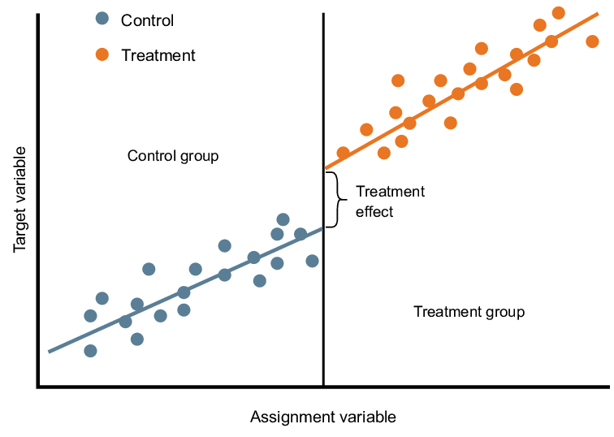

# ECON 433 - Lab Session 9
## Regression Discontinuity Analysis

In this lab you will conduct regression discontinuity analysis using simulated data.

## Background

### Regression Discontinuity

Regression discontinuity (RD) is a research design for estimating the effect of a treatment that only occurs for subjects above or below a certain threshold of a "running variable."

Example of RDs:

- How do house prices change as you go from one side of a school district boundary to another? (We might expect prices to jump as we move from the side with a bad school to the side with a good school.) In this case, the running variable is the distance to the boundary. 

- Suppose there is a national college entrance exam where only students who score above 70% are placed at a college. How do future earnings change for students who score just below 70% compared to those who scored just above 70%? The running variable here is the test score.

Regression discontinuity analysis can be conducted on cross-sectional data. All you need is data on the outcome variable of interest and the running variable.

### Graphical Analysis

RD analysis usually occurs in at least two steps. First, a graphical analysis is performed to see whether it looks like there is a jump in the outcome at the threshold. Below is an example of a RD analysis graph.

### Regression Analysis

The second step is to conduct a regression analysis so that the numerical size of the jump can be estimated.  A RD regression usually has the following form:

$$Y_i = \beta_0 + \beta_1 TREAT_i + f(r_i) + \epsilon_i$$

Here, $r_i$ is the running variable for subject $i$, and $TREAT_i$ is a binary variable indicating whether or not $r_i$ is above or below the threshold for treatment.

$f(r_i)$ is a continuous function of the running variable. In simple RD analysis, $f(r_i)$ is usually chosen to be a polynomial in $r_i$.

## Lab Work

### Setup

For this lab you will need the file `rd_data.csv` which can be downloaded from Canvas.

You will also need the packages `dplyr`, `stargazer`, `lfe`, and `ggplot2`. These should already be installed from previous labs, but if they are not you can install them with `install.packages`.

### Data Description

`rd_data.csv` is a csv file where each row represents a person. There is one row per person and the data represents a single snapshot in time. It is therefore cross-sectional data.

The file has the following columns:

- `person_id`: a unique identification number for the person
- `age`: the person's age
- `employed`: 1 if the person is employed and 0 otherwise

### Objective

A welfare program rewards more generous benefits to individuals with age greater than or equal to 30. 

Your objective is to use RD analysis to test whether the more generous benefits at age 30 reduce the employment rate for people above age 30.

### Making the RD graph

You can make the RD graph with this code:

    # Create a dataframe to generate scatter points
    # (employment rate by age)
    scatter_df <- df %>%
      group_by(age) %>%
      summarize(
        employment_rate = mean(employed)
      )
    
    # Create the graph
    ggplot() + 
      geom_smooth(aes(x=age, y=employed), data=filter(df, age<30)) + 
      geom_smooth(aes(x=age, y=employed), data=filter(df, age>=30)) + 
      geom_point(aes(x=age, y=employment_rate), data=scatter_df) + 
      geom_vline(xintercept=29.5, color="red", linetype="dashed") + 
      ggtitle("Employment Rate vs. Age") + 
      ylab("Employment Rate") + 
      xlab("Age")
      
This code introduces some new concepts, so let's walk through the code step by step.

1. First, we have code to create a new dataframe called `scatter_df` where each row is an age, and for each age we calculate the employment rate for that age.

        # Create a dataframe to generate scatter points
        # (employment rate by age)
        scatter_df <- df %>%
          group_by(age) %>%
          summarize(
            employment_rate = mean(employed)
          )

2. In the `ggplot` code block, this line

        geom_smooth(aes(x=age, y=employed), data=filter(df, age<30))

    Creates a polynomial fit for the average of `employed` for each value of `age`, and plots a smooth line through it. It does so using only data for people under 30. By doing separate plots for people under age 30 and above age 30, we can more clearly see the jump in the regression discontinuity.
    
3. The line

        geom_smooth(aes(x=age, y=employed), data=filter(df, age>=30))

    Creates the smooth polynomial fit for individuals above the age of 30.
    
4. The line

        geom_point(aes(x=age, y=employment_rate), data=scatter_df)
        
    Creates the dots showing the actual (non-smoothed) average for each age, which we computed and stored in `scatter_df`. This step is important so that we can see the raw data and not just the smoothed polynomial fit.
    
### Instructions

Write a script that accomplishes the following tasks:

1. Create a graph showing the discontinuity. (You can use the code above with minimal changes to accomplish this.)

2. Report the results from three regressions:

    - Regress `employed` on a `treat`, where `treat` is a variable you create which indicates whether `age>=30`.
    
    - Regress `employed` on `treat` and `age`.
    
    - Regress `employed` on `treat`, `age`, and `agesq`, where `agesq` is a variable you create equal to the square of `age`.
    
    Report the results in a `stargazer` table.
    
Here is the skeleton of a script to get you started:

    rm(list=ls())     # Clear the workspace
    library(dplyr)    # Load the required libraries
    library(lfe)
    library(stargazer)
    library(ggplot2)
    
    # Load the data
    df <- read.csv("rd_data.csv") 
    
    # Make the RD graph
    # YOUR CODE HERE
    
    # Make a variable called treated which is True if age>=30
    # YOUR CODE HERE
    
    # Make a variable called agesq which is equal to age^2
    # YOUR CODE HERE
    
    # Run the regressions
    # YOUR CODE HERE
    
    stargazer(r1, r2, r3, type="text")
    
Show me your code and output and take the lab quiz to be dismissed.

## Takeaways

- You can conduct RD analysis using both graphs and regressions.

    
    
       

